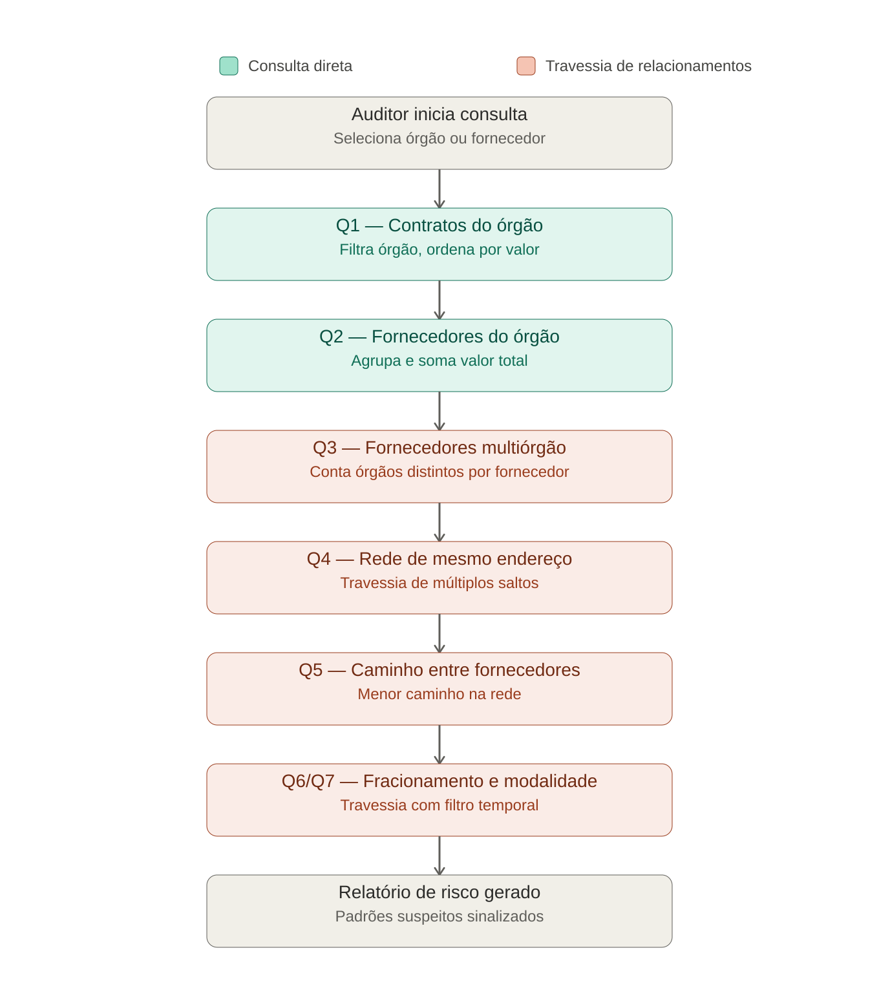

# RadarPNCP — Mapeamento de Redes de Contratação Pública em Grafo


**Curso:** Especialização em Big Data — Escola Politécnica da USP
**Disciplina:** Repositórios de Dados e NoSQL (eEDB-016)
**Prof. Dr. Pedro Luiz Pizzigatti Corrêa — Prof. Dra. Jeaneth Machicao**
**Tecnologia NoSQL:** Neo4j (grafos) — única tecnologia utilizada no projeto
**Domínio:** contratações públicas do PNCP, modeladas como rede de relacionamentos entre órgãos públicos, fornecedores e contratos

---

**Aviso:** Os dados utilizados neste repositório são, em sua maioria, fictícios/simulados, conforme o escopo da disciplina exige. Quando dados reais do PNCP são incorporados (amostra de fornecedores multiórgão), eles são extraídos de um pipeline próprio de ingestão já existente ([Lab01_PART1_5479786](https://github.com/hrvfreitas/Lab01_PART1_5479786)) e não passaram por auditoria externa — não devem ser usados como base para decisões oficiais ou denúncias, servindo apenas como demonstração técnica de modelagem NoSQL.

## Sumário

1. [Domínio e Justificativa](#1-domínio-e-justificativa)
2. [Arquitetura do Grafo](#2-arquitetura-do-grafo)
3. [Estrutura de Diretórios](#3-estrutura-de-diretórios)
4. [Application Workflow Diagram](#4-application-workflow-diagram)
5. [Consultas Planejadas (Q1–Q7)](#5-consultas-planejadas-q1–q7)
6. [Esquema do Grafo](#6-esquema-do-grafo)
7. [Instruções de Execução](#7-instruções-de-execução)
8. [Logs de Execução das Consultas](#8-logs-de-execução-das-consultas)
9. [Observações Técnicas](#9-observações-técnicas)
10. [Roadmap de Detectores](#10-roadmap-de-detectores)
11. [Uso de IA Generativa](#11-uso-de-ia-generativa)

---

## 1. Domínio e Justificativa

O **RadarPNCP** é uma aplicação fictícia de apoio à auditoria de contratos públicos, destinada a auditores de controle externo (ex.: Tribunais de Contas). Permite buscar um órgão público ou fornecedor e visualizar a rede de relacionamentos entre contratos, fornecedores e órgãos, destacando padrões que costumam indicar risco: concentração de fornecimento, fornecedores coligados pelo mesmo endereço, e indícios de fracionamento de despesa.

| Atributo | Valor |
| --- | --- |
| **Tecnologia escolhida** | Neo4j (modelo de grafos) |
| **Critério da matriz de decisão** | Aplicações cujo foco principal mapeia redes de interconexões — redes de contatos, fraudes financeiras ou dependências diretas |
| **Por que não Documento/Chave-valor** | Não favorece naturalmente consultas de travessia multi-salto (RF4, RF5) |
| **Por que não Família de Colunas** | Domínio não tem perfil de ingestão massiva em tempo real (IoT/logs) nessa escala de PoC |
| **Por que não Vetorial** | Não atende aos requisitos de rede de relacionamentos (RF3–RF7) levantados |

O padrão de acesso predominante do negócio não é busca direta por chave nem ingestão massiva sequencial — é a navegação por múltiplos saltos sobre uma rede de relacionamentos entre fornecedores, contratos e órgãos, para identificar conexões que não estão explícitas em uma única coleção de dados.

## 2. Arquitetura do Grafo

```
(OrgaoPublico) -[:CONTRATOU]-> (Contrato) <-[:FORNECEU]- (Fornecedor)
                                    |
                              [:DE_MODALIDADE]
                                    v
                              (Modalidade)

(Fornecedor) -[:MESMO_ENDERECO]-> (Fornecedor)   // rede de risco
```

`CONTRATOU`, `FORNECEU` e `DE_MODALIDADE` não carregam propriedades — os atributos relevantes (valor, datas) já estão no nó `Contrato`. `MESMO_ENDERECO` é a relação central para a particularidade de grafos exigida pelo enunciado: sem ela, Q4 e Q5 não existiriam.

## 3. Estrutura de Diretórios

```
radarpncp/
├── docker-compose.yml                      # Neo4j 5, volumes persistentes
├── etapa3_poc_radarpncp.cypher              # criação + 10 registros simulados + Q1-Q7
├── ingest_postgres_to_neo4j.py              # ingestão real (Postgres) + endereço via BrasilAPI
├── ingest_postgres_to_neo4j_local_rf.py     # variante: endereço via base local da Receita Federal
├── docs/
│   ├── declaracao_problema_radarpncp.docx   # Parte 1 do relatório (entregável)
│   ├── workflow_pncp_grafo.png              # Application Workflow Diagram
│   ├── tela_inicial_radarpncp.png           # wireframe — busca e alertas
│   ├── tela_orgao_radarpncp.png             # wireframe — detalhe do órgão (Q1/Q2)
│   └── tela_rede_radarpncp.png              # wireframe — rede de relacionamentos
├── screenshots/                             # prints de execução das queries (preencher após rodar)
└── data/                                    # volume do Neo4j — não versionado (.gitignore)
```

## 4. Application Workflow Diagram



Jornada do auditor desde a busca inicial até a geração do relatório de risco, passando pelas consultas diretas (Q1, Q2) e pelas consultas de travessia de relacionamentos no grafo (Q3 a Q7).

## 5. Consultas Planejadas (Q1–Q7)

| # | Consulta | Atributos pesquisados / ordenados / filtrados | Travessia |
| --- | --- | --- | --- |
| Q1 | Contratos de um órgão | filtra `cnpj` do órgão; ordena por `valor_global` desc; filtra período por `data_assinatura` | Não — 1 salto direto |
| Q2 | Fornecedores de um órgão, valor agregado | filtra `cnpj` do órgão; agrupa por fornecedor; ordena `SUM(valor_global)` | Não — 1-2 saltos diretos |
| Q3 | Fornecedores multiórgão | conta `COUNT(DISTINCT órgão)` por fornecedor; filtra > N órgãos | Sim — grau de conexão |
| Q4 | Rede de mesmo endereço | percorre `MESMO_ENDERECO`; filtra órgão em comum entre fornecedores conectados | Sim — particularidade central de grafos |
| Q5 | Caminho entre dois fornecedores | define fornecedor início/fim; calcula menor caminho na rede de vínculos | Sim — shortest path |
| Q6 | Recontratação em janela curta | mesmo órgão + mesmo fornecedor com novo contrato em até 30 dias; ordena por `dias_entre_contratos` e `valor_somado` | Sim — travessia + filtro temporal (estágio 1 do detector de fracionamento) |
| Q7 | Possível fracionamento | refina a Q6: ambos os contratos com `valor_global` sob o limiar de dispensa (parâmetro; R$ 10 mil nos dados de validação), cuja soma o ultrapassa | Sim — travessia + filtro temporal + filtro de valor (estágio 2) |

## 6. Esquema do Grafo

**Nós**

| Label | Propriedades |
| --- | --- |
| `OrgaoPublico` | `cnpj`, `nome`, `codigo_unidade`, `nome_unidade` |
| `Fornecedor` | `ni_fornecedor`, `nome`, `tipo_pessoa`, `endereco` |
| `Contrato` | `id_contrato_pncp`, `numero_contrato`, `processo`, `objeto_contrato`, `valor_inicial`, `valor_global`, `valor_parcelas`, `data_assinatura`, `data_vigencia_inicio`, `data_vigencia_fim`, `data_publicacao` |
| `Modalidade` | `id_modalidade`, `nome` |

**Relacionamentos**

| Relacionamento | Direção | Cardinalidade |
| --- | --- | --- |
| `CONTRATOU` | `OrgaoPublico` → `Contrato` | 1 → N |
| `FORNECEU` | `Fornecedor` → `Contrato` | 1 → N |
| `DE_MODALIDADE` | `Contrato` → `Modalidade` | N → 1 |
| `MESMO_ENDERECO` | `Fornecedor` → `Fornecedor` | N → N |

`tipo_pessoa` e `endereco` em `Fornecedor` são campos enriquecidos — a API do PNCP não traz endereço; vêm da BrasilAPI/Receita Federal (dados reais) ou são simulados (dados fictícios), conforme a fonte usada na carga.

## 7. Instruções de Execução

### Subir o Neo4j

```bash
docker compose up -d
docker compose ps    # espera status: healthy
```

### Opção A — dados simulados (não depende de nada externo)

```bash
docker compose exec neo4j cypher-shell -u neo4j -p radarpncp123 \
  -f /var/lib/neo4j/import/etapa3_poc_radarpncp.cypher
```

### Opção B — dados reais (depende do Postgres do pipeline PNCP já estar populado)

```bash
pip install psycopg2-binary requests neo4j --break-system-packages
python ingest_postgres_to_neo4j.py
# ou, com endereço via base local da Receita Federal em vez da BrasilAPI:
python ingest_postgres_to_neo4j_local_rf.py
```

### Acessar

```
http://localhost:7474
usuário: neo4j
senha:   radarpncp123
```

## 8. Logs de Execução das Consultas

*Em preenchimento.* Print de cada uma das sete consultas (Q1 a Q7) retornando resultado será adicionado a `screenshots/` após a execução completa em sala de aula, conforme exigido pelo Relatório Técnico (Parte 2 do entregável).

## 9. Observações Técnicas

**Por que dados reais e simulados misturados?**
A base combina contratos reais do PNCP — extraídos do pipeline já validado, priorizando fornecedores que comprovadamente atuam com múltiplos órgãos — com um pequeno conjunto de registros simulados, inserido propositalmente para garantir a demonstração das consultas de travessia (Q4 a Q7). Vínculos como mesmo endereço entre fornecedores são reais no domínio, mas pouco prováveis de surgir por acaso em uma amostra pequena; sem essa garantia, a apresentação correria o risco de não evidenciar ao vivo exatamente as consultas que justificam a escolha de um banco orientado a grafos.

**Limitação conhecida:** o campo `endereco` não existe no endpoint `/contratos` da API do PNCP. Quando preenchido com dado real, vem de uma fonte externa (BrasilAPI, que espelha o CNPJ público da Receita Federal, ou uma base local dos Dados Abertos do CNPJ) — não do PNCP em si.

**Escala:** este projeto é deliberadamente uma PoC pequena (10 a ~200 registros), não uma réplica do pipeline relacional de 3,65M de contratos do [Lab01_PART1_5479786](https://github.com/hrvfreitas/Lab01_PART1_5479786). O foco aqui é a modelagem orientada a consultas em grafo, não o volume de dados. Para o corpus completo, a carga exigiria índices adicionais (`data_assinatura`), lotes via `UNWIND`/`apoc.periodic.iterate` e reescrita das comparações par a par (Q4/Q6/Q7) com agrupamento prévio, evitando explosão combinatória.

**Revisão das consultas (jul/2026):** as queries Q4, Q6 e Q7 passaram por revisão de corretude, documentada no cabeçalho de `etapa3_poc_radarpncp.cypher`. Destaques: substituição de `duration.between` (que normaliza em meses+dias e faria "1 mês e 5 dias" passar num filtro de 30 dias) por `duration.inDays`; inclusão de pares de contratos assinados no mesmo dia (o caso mais evidente de fracionamento); e deduplicação de pares espelhados nas travessias não-direcionadas.

## 10. Roadmap de Detectores

O detector de vínculos evolui em gerações, cada uma reduzindo os falsos positivos da anterior:

| Geração | Detector | Fonte | Status |
| --- | --- | --- | --- |
| 1 | Mesmo endereço (`MESMO_ENDERECO`) | Receita Federal (BrasilAPI ou dumps locais) | Implementado (Q4/Q5) |
| 2 | Recontratação + fracionamento temporal/valor | PNCP | Implementado (Q6/Q7) |
| 3 | Mesmo grupo empresarial (raiz do CNPJ — 8 dígitos) | Derivável do próprio `ni_fornecedor` | Desenhado |
| 4 | Sócios em comum (`SOCIO_DE` via QSA) e revezamento de vencedores em licitações (bid rotation) | Dados Abertos do CNPJ (QSA) + dados de participantes do PNCP | Concebido |

A geração 4 exigiria modelar a licitação como nó próprio (`(Fornecedor)-[:PARTICIPOU]->(Licitacao)`), permitindo detectar alternância de vencedores entre empresas societariamente vinculadas — o padrão clássico de conluio em contratações públicas.

## 11. Uso de IA Generativa

O desenvolvimento contou com assistência de IA generativa (Claude/Anthropic) para revisão de código e queries, depuração e estruturação do material de apresentação. A modelagem do domínio, as decisões de arquitetura, a estratégia de amostragem e a análise dos resultados são de autoria do grupo.
